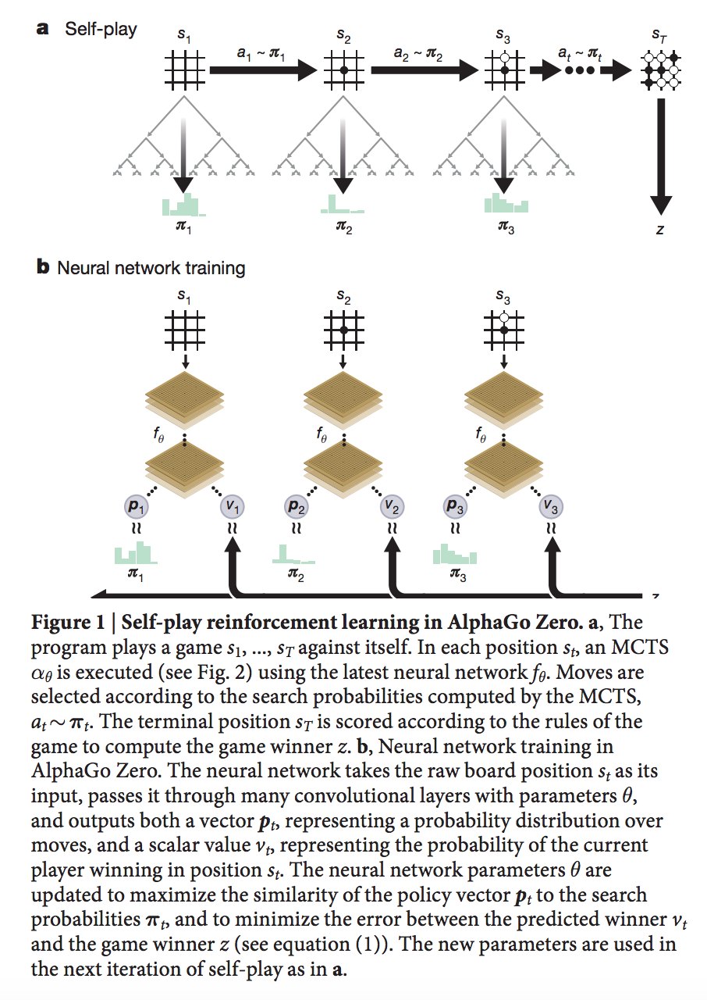

# AlphaGo Zero

DeepMind strikes again with a higher performing, simpler version of AlphaGo.

Main contributions of AlphaGO Zero:

> It is trained solely by self-play reinforcement learning, starting from random play, without any supervision or use of human data.

>  It uses only the black and white stones from the board as input features.

> It uses a single neural network, rather than separate policy and value networks.

They use a single neural network $f_{\theta}$ that calculates move probabilities ${\bf p}$ and values $v$ from game states $s$, $({\bf p}, v) = f_{\theta}(s)$.

In $s$, a Monte Carlo Tree Search (MCTS) is executed, guided by the neural network $f_{\theta}$. The search outputs move probabilities $\pi$. The move probabilities $\pi$ are normally better than ${\bf p}$, so we can adjust $\pi$  to be closer to ${\bf p}$.

The following figure depicts the entire training algorithm. Read the caption and you'll get the entire training algorithm. It runs an entire game against itself using the MCTS lookahead (w/ lots of tricks which are in the paper) then updates its neural network to more closely match the MCTS move probabilities and final value of the game.

The entire loss function is just

$$l = (z-v)^2 - \pi^T \log {\bf p} + c \| \theta \|^2,$$

where $z$ is the true winner according to the player making the move and $c$ is a scalar parameter. The first term is the mean-squared error, the second term is the cross-entropy loss and the third term is L-2 weight normalization.

### Details of Training Procedure

Parameters $\theta_i$ are continually optimized from self-play data and the resulting players $\alpha_{\theta_i}$ are evaluated. They keep a "best" player around, $\alpha_{\theta_{* }}$. I distill it here.

At step $i$:
1. Run $\alpha_{\theta_{* }}$ for 25k games using 1600 simulations of MCTS.
2. Use SGD w/ 100k mini-batches of size 2048 randomly sampled from last 500k games using the loss function $l$ to get $\theta_{i+1}$.
3. Compare $\alpha_{\theta_{i+1}}$ to $\alpha_{\theta_{* }}$ by pitting them against each other, updating if $\alpha_{\theta_{i+1}}$ performs 5% better.

The algorithm is pretty simple, I don't understand all the MCTS magic though. That seems to be the bread and butter of AlphaGo Zero though, as well an abundance of computation.

### 1700 years on community hardware

Recomputing the AlphaGo zero weights will supposedly [take 1700 years on community hardware](http://computer-go.org/pipermail/computer-go/2017-October/010307.html). There is an [interesting effort](https://github.com/gcp/leela-zero) to crowdsource training.
