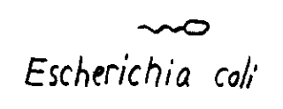
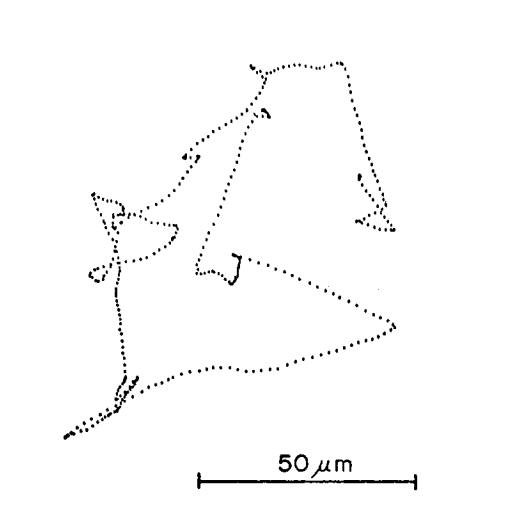

# Life at Low Reynold's Number

This talk, by Harvard physics professor Edward Purcell in 1976, seeks to explain some of the quirky physics experienced by extremely small organisms which experience life at a low Reynold's number.

### What is Reynold's number?

Let's consider an object with length $L$ moving with velocity $v$ in a fluid with viscosity $\eta$ and density $\rho$. Let $\nu=\frac{\eta}{\rho}$ be the kinematic viscosity. Then the Reynolds number (Re) of the object is equal to

$$Re = \frac{L v \rho}{\eta} = \frac{L v}{\nu}.$$

Reynold's number is a dimensionless quantity, which we can check using dimensional analysis

$$\text{SI Units}[Re] = \frac{m \cdot \frac{m}{s} \cdot \frac{kg}{m^3}}{ \frac{kg}{m\cdot s}}=1.$$

It turns out, through analyzing the Navier-Stokes equation outside of the scope of this review, that Reynold's number is equal to the ratio of inertial forces to viscous forces. This means that objects with low Re experience mainly viscous forces and objects with high Re's experience mainly inertial forces. This talk focuses on objects with low Re's.

### Typical Re's

For water, the kinematic viscosity $\nu=10^{-2} \frac{cm^2}{s}$. This means that an object with a length of $1 cm$ moving at $1 \frac{cm}{s}$ in water will has a Reynold's number of 1. Every organism in the world has a Reynold's number as we all inhabit fluids (e.g. water and air). Air, peculiarly, is considered a fluid because it is a substance which flows. Here are some example Reynold's numbers:
* Small organism, 1 micron in size and speed of $\frac{30 \mu m}{s}$: $3 \times 10^{-6}$
* Ciliate, small hair-like organelles: $.01$
* Smallest fish: $1$
* Typical pitch in MLB: $2 \times 10^5$
* Person swimming: $4 \times 10^6$
* A large ship: $5 \times 10^9$

To get a lower Re in a given fluid we require small and slow objects.

### What does an organism at low Re experience

At low Re, inertial forces play no role whatsoever. In the words of Purcell, what you are doing at the moment is entirely determined by the forces exerted on you *at that moment*, and by nothing in the past. For you to be at that Re, you would be swimming in a pool filled with molasses and only able to move your body at $1 \frac{cm}{s}$. If you pushed off the side of the pool, you would quickly come to a stop once you stop exerting force on your body because there is no inertia.

An animal at low Re can't swim through reciprocal motion, because there is essentially no inertia. If an animal has one degree of freedom, or hinge, it is forced into reciprocal motion and can't move. Thus, it needs at least two hinges. He proposes multiple simple two-hinge organisms which can swim at low Re, culminating with the corkscrew.

### e. Coli

The e. Coli actually uses a mechanism similar to a corkscrew.

A scientist measured the movement of e. Coli and it is quite peculiar, as shown in the figure below.

Why does it have such drastic changes in direction at seemingly similar intervals? Purcell seeks to answer this question. e. Coli has a Re approximately equal to our Small organism from above, $3 \times 10^{-6}$. Through some analysis, he shows that it has a swimming efficiency of about 1%. However, this is not an issue because that only costs $0.5$ W / kg of energy, which is a small portion of its energy budget. It turns out that the interesting phenomenon here is diffusion. The transport of wastes away from the animal and food to the animal is determined by the diffusion and how much the animal can stir the fluid around it. It turns out the ratio of stirring to diffusion is $\frac{Lv}{\nu}$. For our e. Coli, this constant is approximately $10^{-2}$. In other words, diffusion dominates at this scale. So to avoid waste and get nutrients, the animal needs to get to and test a new area which is independent its previous area. And the distance to this new area is the magical distance to outrun diffusion: $30 \mu m$.

Thus, the main result of this talk/paper is that **the animal doesn't swim to get food, it swims to get to outrun diffusion**.
